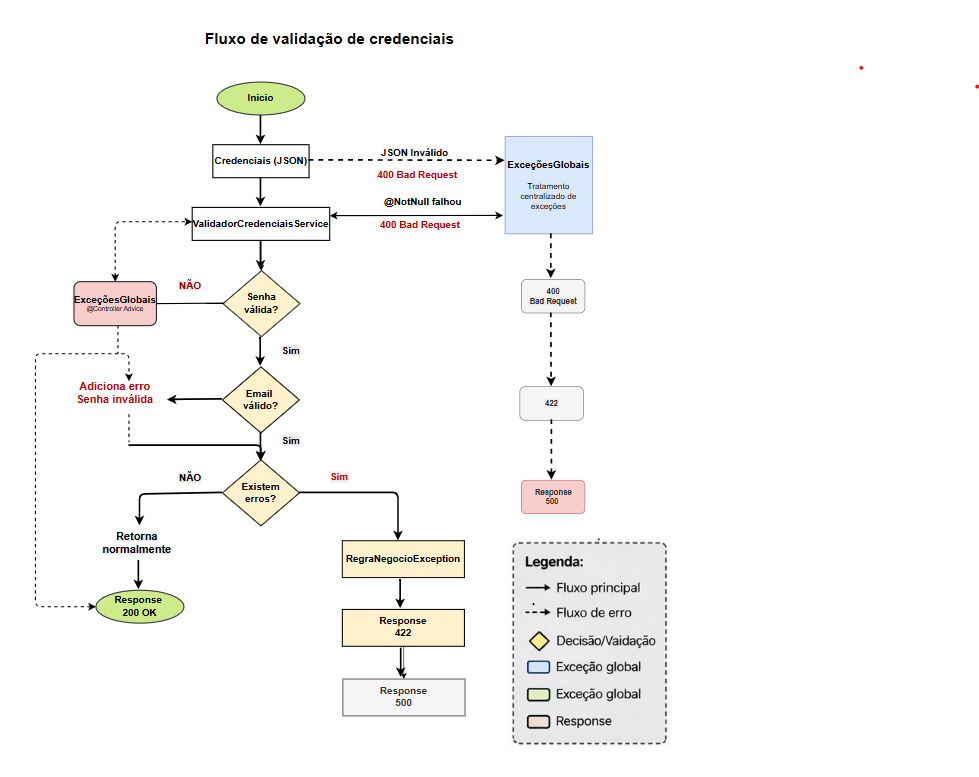

# API Validação de Credenciais

API REST desenvolvida em **Java + Spring Boot** para validação de senha e e-mail, baseada em regras configuráveis e aplicando boas práticas de arquitetura.

---

## Objetivo

Este projeto foi desenvolvido com foco em:

* Aplicação de princípios **SOLID**
* Separação de responsabilidades
* Implementação de regras de negócio desacopladas
* Uso de composição de políticas de validação
* Padronização de resposta da API

---

## Arquitetura

O projeto segue uma arquitetura em camadas com separação clara entre domínio e aplicação:

```text
Controller → UseCase → Policy → Rules → DTO
```

### Estrutura de pacotes

```text
br.com.clrf
│
├── adapter
│   ├── controller
│   ├── dto
│   └── response
│
├── domain
│   ├── comuns
│   ├── email
│   └── senha
│
├── usecase
├── config
```

---

## Fluxo da aplicação

1. O **Controller** recebe a requisição HTTP
2. O **UseCase** executa a validação
3. A **Policy** aplica uma lista de regras
4. As **Rules** validam individualmente os dados
5. O resultado é retornado via **DTO**



---


## Tratamento de Exceções

A API utiliza um handler global (`ExcecoesGlobais`) para centralizar o tratamento de erros, garantindo padronização das respostas.

### Cenários tratados:

- **400 Bad Request**
  - JSON inválido
  - Campos obrigatórios ausentes (@NotNull)

- **422 Unprocessable Entity**
  - Regras de negócio não atendidas (senha/email inválidos)

- **500 Internal Server Error**
  - Erros inesperados

---

## Observabilidade (Logs)

A aplicação utiliza logs para rastreabilidade do fluxo:

- **INFO**
  - Validação bem-sucedida

- **WARN**
  - Falha em regras de negócio (senha/email)

- **ERROR**
  - Exceções não tratadas

Isso permite evolução futura para integração com ferramentas como:
- ELK Stack
- CloudWatch
- Datadog

---
## Tecnologias utilizadas

* Java 21
* Spring Boot
* Maven
* Lombok
* Jakarta Validation
* SonarQube (análise de código)

---

## Como executar o projeto

### Pré-requisitos

* Java 21+
* Maven

### 🔧 Build

```bash
mvn clean install
```

### Executar

```bash
mvn spring-boot:run
```

A aplicação estará disponível em:

```text
http://localhost:8080
```

---

## Endpoint

### Validar credenciais

```http
POST /credenciais/validacoes
```

---

## Exemplo de requisição

### cURL

```bash
curl --location 'http://localhost:8080/credenciais/validacoes' \
--header 'Content-Type: application/json' \
--data '{
  "senha": "Senha@123",
  "email": "teste@email.com"
}'
```

---

### JSON

```json
{
  "senha": "Senha@123",
  "email": "teste@email.com"
}
```

---

## Exemplo de resposta

### ✔ Validado com sucesso

```json
{
  "valido": true,
  "mensagem": "Credenciais validadas com sucesso"
}
```

### ❌ Validação falhou

```json
{
  "valido": false,
  "mensagem": "A senha deve conter pelo menos um número."
}
```

---

## Regras de validação

### Senha

* Tamanho mínimo
* Letra maiúscula e minúscula
* Número
* Caractere especial
* Sem espaços
* Sem caracteres repetidos

### Email

* Formato básico válido
* Apenas um "@"
* Domínio válido
* TLD válido
* Sem espaços
* Sem duplicidade de pontos

---

## Composição de regras

As regras são aplicadas via configuração:

* `ComposicaoRegrasSenha`
* `ComposicaoRegraEmail`

Utilizando o padrão:

```text
Policy + Strategy
```

---

## Qualidade de código

O projeto utiliza **SonarQube** para análise de qualidade:

* Code smells
* Boas práticas
* Manutenibilidade

---

## Decisões técnicas

* Uso de **Policy Pattern** para aplicação de regras
* Separação entre domínio e aplicação
* Regras desacopladas e reutilizáveis
* Uso de DTO para padronização de resposta

---

## Referências

* Sobre o case: https://github.com/itidigital/backend-challenge
* Testes unitários:

  * https://zup.com.br/blog/testes-unitarios/
  * https://www.freecodecamp.org/news/java-unit-testing/
* Teste unitário vs integrado:

  * https://pt.stackoverflow.com/questions/115146/qual-a-diferen%C3%A7a-entre-teste-unit%C3%A1rio-e-teste-integrado
* Princípios SOLID:

  * https://pt.stackoverflow.com/questions/178718/o-que-s%C3%A3o-os-princ%C3%ADpios-solid
* Composição:

  * https://www.geeksforgeeks.org/java/composite-design-pattern-in-java/

---

